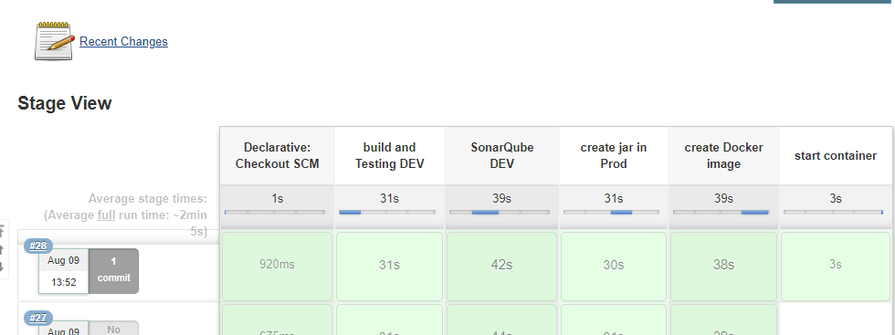

# Exercise 3

### Infrastructure

I have created 2 instances in AWS to save time **( and money )**. First one is a Jenkins machine with docker to start the application in the last step of the pipeline and the second one is an instance with docker to start SonarQube. 

All these infrastructure in my case is running in my AWS account. 

### Jenkins pipeline

